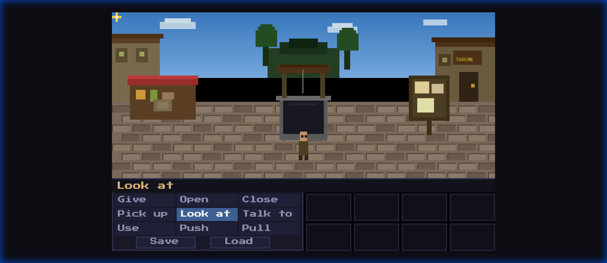
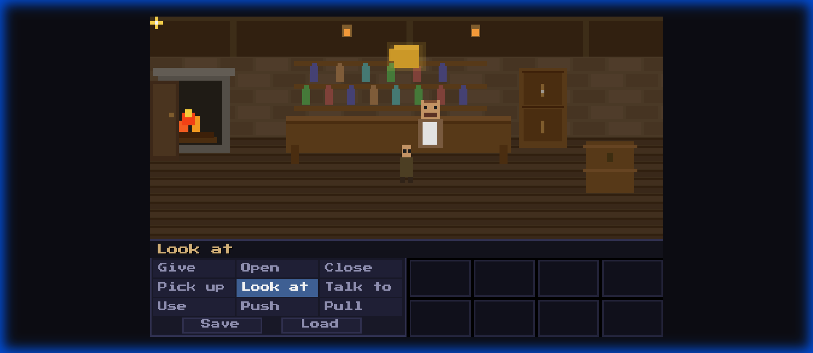
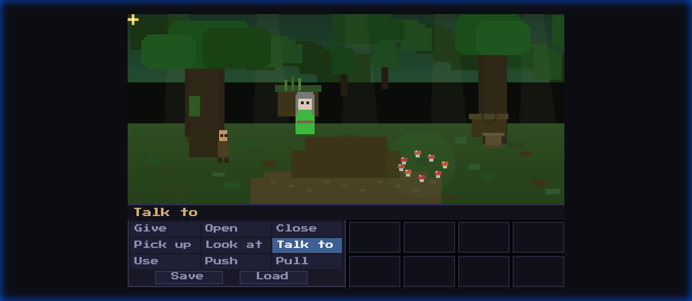
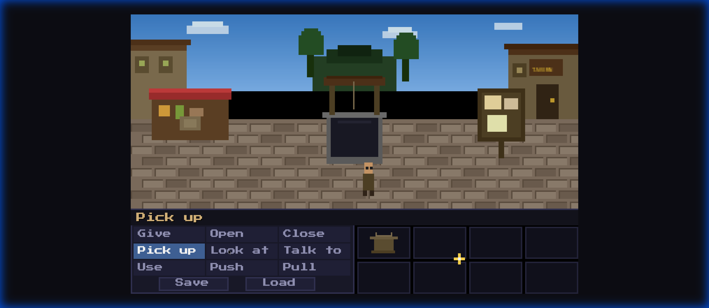

# 🎮 Retro Adventure Engine (DSL Edition) - ALPHA

A data-driven, SCUMM-inspired point-and-click adventure engine built with vanilla JavaScript and Vite. This project demonstrates a powerful **YAML-based DSL** for defining game worlds, characters, dialogues, and complex puzzles without writing code.



## 🚀 Features

-   **Data-Driven Core**: 100% of game content (rooms, items, NPCs, dialogues, puzzles) is defined in human-readable YAML files.
-   **Trait-Based Character Generator**: Procedurally assembles pixel-art characters from descriptive traits.
-   **Advanced Puzzle DSL**: Robust "Lock and Key" pattern supporting complex dependency chains.
-   **Dynamic Dialogues**: Branching trees with logical conditions and "idle line" exhaustion.
-   **Retro SCUMM UI**: Classic 9-verb interface with pixel-art aesthetics and save/load persistence.

## 🖼️ Visual Showcase

### Trait-Based Character Generation

Characters are built dynamically from YAML traits, allowing for endless variety with minimal assets.

| NPC: Bartender Gruff | NPC: The Hermit |
| :---: | :---: |
|  |  |

### State Persistence & Inventory

The engine handles complex state management, ensuring that player progress and inventory are preserved across sessions.



## 📁 Project Structure

```text
/
├── content/              # 🏺 Game Data (YAML DSL)
│   └── enchanted_tankard/
│       ├── game.yaml      # Manifest & Global Config
│       ├── rooms/         # Scene definitions
│       ├── npcs.yaml      # Character trait definitions
│       ├── items.yaml     # Interactable item definitions
│       ├── puzzles.yaml   # Logic & Interaction Resolver
│       └── dialogues/     # Branching conversation trees
├── src/
│   ├── engine/           # ⚙️ Core Systems (Loader, Registry, Generator)
│   ├── systems/          # 🧩 Game Systems (Inventory, Dialogue, Walking)
│   └── main.js           # 🚀 Entry Point (GameEngine)
└── public/               # 🖼️ Static Assets
```

## 🛠️ The DSL (Domain Specific Language)

### Defining a Room
Rooms are defined with walkable areas, hotspots, and exits.
```yaml
id: village_square
name: "Village Square"
description: "The heart of the town. A stone well sits in the center."
hotspots:
  - id: stone_well
    name: "Stone Well"
    rect: [140, 80, 40, 40]
    responses:
      look_at: "It's an old well. The water looks deep."
      talk_to: "You shout into the well. 'Hello!' ... Your echo mocks you."
```

### Defining a Puzzle
Puzzles resolve interactions between verbs, items, and targets.
```yaml
id: bribe_hermit
trigger:
  verb: give
  item: gold_coin
  target: hermit
conditions:
  notFlag: hermit_bribed
actions:
  - say: "The hermit's eyes light up. 'Shiny!'"
  - addItem: "enchanted_key"
  - setFlag: "hermit_bribed"
```

## 🪄 Getting Started

1.  **Clone the repo**:
    ```bash
    git clone https://github.com/eridia/retro-adventure-dsl.git
    ```
2.  **Install dependencies**:
    ```bash
    npm install
    ```
3.  **Run Development Server**:
    ```bash
    npm run dev
    ```

## 🏗️ Future Roadmap (Phase 2)

-   [ ] **Visual Scene Editor**: A browser-based tool to "paint" walkable areas and drag-and-drop hotspots.
-   [ ] **LLM-Powered Descriptions**: Use AI to generate flavor text for unmatched interactions based on DSL context.
-   [ ] **Enhanced Animations**: Sprite sheet support for character walking and idle states.
-   [ ] **Global State Browser**: Debug UI to visualize flags and puzzle dependency trees in real-time.

---

Built with ❤️ by CaDs. Inspired by the classics of the 90s.
